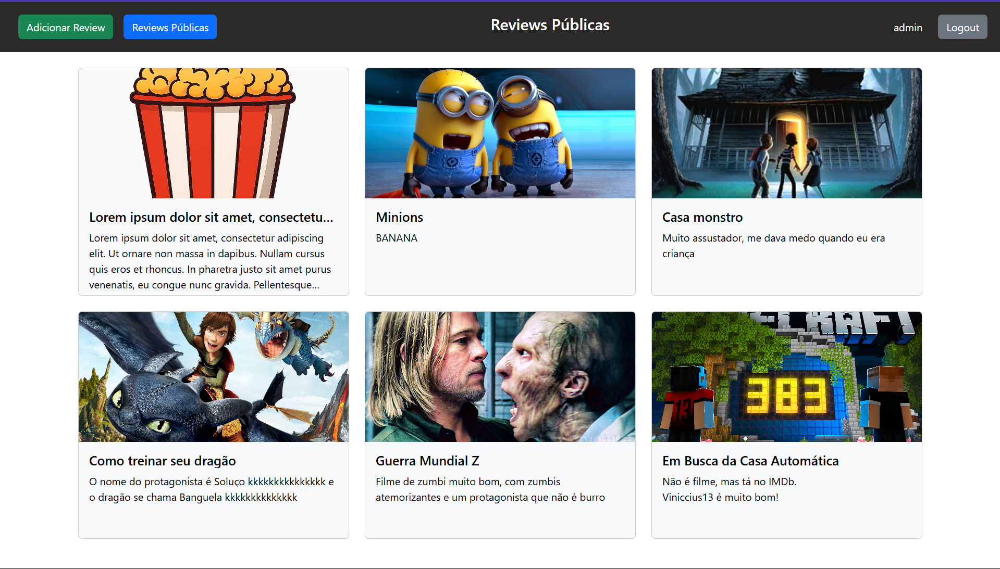

# Projeto: desenvolvimento de aplicação com API web pública

Imagens do **site criado**:  

Acesso: https://elc1090.github.io/project3-2025a-alissonbc/html/

#### Desenvolvedor
Álisson Braga Canabarro, Ciência da Computação

##### Descrição

#### Desenvolvimento

#### Tecnologias

- HTML

#### Ambiente de desenvolvimento

VS Code com as extensões:
- HTML CSS Support

#### Referências e créditos

Chat GPT, exemplo resumido de prompt:

---
Projeto entregue para a disciplina de [Desenvolvimento de Software para a Web](http://github.com/andreainfufsm/elc1090-2025a) em 2025a
